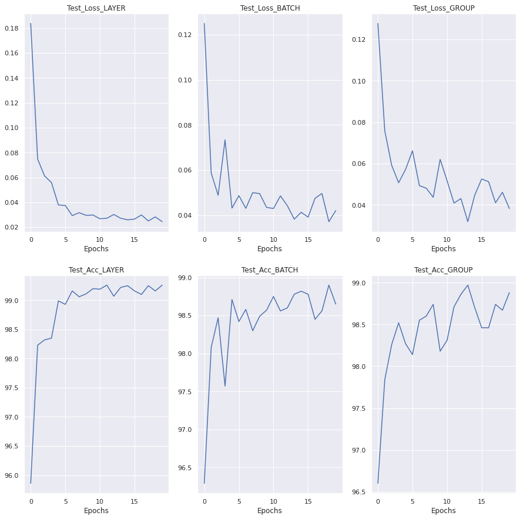
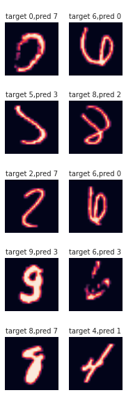

## Introduction
The assignment is to apply the different Normalization techniques on the code that was devloped in the Assignment #4 (one with 99.44%) 
[CodingDrill_S3.ipynb](https://github.com/TSAI-EVA8/CodingDrill/blob/master/code/CodingDrill_S3.ipynb)

The various Normalization techniques used are:
1. Layer Normalization
2. Group Normalization
3. Batch Normalization + L1 Regularization

Additionally the code has been designed to run all the techiniques one by one and collect the test & training losses and accuracies.

## What is Batch, Layer & Group Normalization

These are the normalization techniques that essentially normalizes the data (centers the data around the mean). With respect to the convolution network, a network is defined in terms of (Batch, Channels, Height_Image, Width_Image)
Now the mean can be taken across the channels or batches. The techniques are differentiated on the basis of which dimention they are applied. 

The following images make it clear

### Batch Normalization

* In Batch normalization the mean is taken for all the features that appear on a particular channel for all the images in the batch.

* Batch normalization normalizes each feature independently across the mini-batch

* As batch normalization is dependent on batch size, it’s not effective for small batch sizes. A large batch size,  is difficult to obtain for larger models and datasets and so it loses it benefits.

* In case of the batch normalization the number of means & std calculated is equal to the number of channels in the Layer

### Layer Normalization

* Layer normalization normalizes each of the inputs in the batch independently across all features. Basically 1 image at a time. Across all the channels. 

* Layer normalization is independent of the batch size, so it can be applied to batches with smaller sizes as well

* In Layer Normalization the number of means and std calculated are equal to the bacth size

### Group Normalization

The Group Normalization is the mixture of the Layer and the Batch. It takes 1 image at a time but works on a combination of channels. Basically in Layer Normalization the group consist of all the channels while in the group a subset of the channels form the group. 
The mean and variance is calculated separately for each of the group and normalization is applied to each group separately.

## Results

Loss & Accuracy graphs

The curve shows that the best results were obtained with the Layer normalization

Here are Some of the Training logs as well

### Batch Normalization

### Layer Normalization

### Group Normalization

## Misclassifications

The purpose is to find out which images were classified wrongly by the model. 
These images are generally tricky.

### Batch Normalization Misclassified images

### Layer Normalization Misclassified images

### Group Normalization Misclassified images

